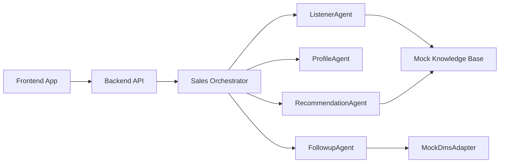

# SalesMate AutoPilot

SalesMate AutoPilot is a runnable demo system for an automotive sales copilot. It shows how a dealer-facing app can combine real-time reception support, multi-agent orchestration, DMS integration contracts, and a complete customer journey from showroom reception to follow-up.

The project is intentionally dependency-light for demo reliability. It uses a vanilla frontend and a Node.js backend built on the standard `http` module, so it can run without installing npm packages.

## Quick Links

- [Demo script](docs/demo-script.md)
- [Architecture notes](docs/architecture.md)
- [API schema](docs/api-schema.md)
- [GitHub showcase guide](docs/github-showcase.md)

## What This Demo Shows

- A sales dashboard for showroom consultants.
- A real-time reception cockpit with scripted dialogue playback.
- Visible multi-agent coordination for listening, profiling, recommendation, reporting, archiving, and follow-up.
- Optional local LLM enhancement through Ollama, with rule-based fallback.
- Vehicle recommendation, competitor response cards, and policy/finance boosters.
- A customer-facing departure report.
- A DMS adapter layer reserved for OEM or dealer information systems.
- A three-layer customer data storage strategy: DMS primary storage, SalesMate local processing storage, and optional BI aggregation.
- A full scenario flow for GitHub reviewers or judges to run locally.

## Architecture



## Project Structure

```text
salesmate-autopilot/
  frontend/
    index.html
    src/
      app.js
      styles.css
  backend/
    src/
      agents/
      data/
      integrations/dms/
      orchestrator/
      server.js
  docs/
    demo-script.md
    architecture.md
  package.json
```

## Run Locally

Use Node.js 18 or later.

```bash
npm start
```

Then open:

```text
http://localhost:5177
```

If npm is unavailable, run the server directly:

```bash
node backend/src/server.js
```

On this Windows workspace, the bundled Node.js can be used directly:

```powershell
& 'C:\Users\QWER\.cache\codex-runtimes\codex-primary-runtime\dependencies\node\bin\node.exe' backend/src/server.js
```

Optional environment configuration:

```text
.env.example
```

To connect the backend to a Dify Chatflow app, copy `.env.example` to `.env` and set the app API key:

```text
DIFY_ENABLED=true
DIFY_API_BASE=http://localhost:8080/v1
DIFY_API_KEY=your-dify-app-api-key
```

The current demo does not require installing dependencies.

## Demo Flow

1. Open the sales dashboard.
2. Click "一键跑完整流程" for the guided scenario, or enter Zhang's reception cockpit manually.
3. In manual mode, click "播放下一句" to simulate real-time dialogue.
4. Watch the customer profile, Agent Trace, and AI side cards update.
5. Open recommendation and competitor pages.
6. Generate the departure report.
7. Sync the customer record to the mock DMS.
8. Review the follow-up strategy and storage boundary.

## API Surface

Full request and response examples are available in [docs/api-schema.md](docs/api-schema.md).

| Method | Endpoint | Purpose |
| --- | --- | --- |
| GET | `/api/demo` | Load mock customer, scripts, models, and policies |
| POST | `/api/asr/transcribe` | Mock ASR endpoint reserved for speech recognition integration |
| GET | `/api/llm/status` | Return optional LLM provider status and fallback mode |
| POST | `/api/agents/coordination` | Return agent registry, execution plan, shared memory, and run log |
| POST | `/api/session/start` | Start a customer reception session |
| POST | `/api/dialogue/ingest` | Add a dialogue utterance and trigger agent orchestration |
| POST | `/api/agent/analyze` | Return the current session analysis |
| POST | `/api/recommendations` | Return vehicle recommendations and competitor cards |
| POST | `/api/report/generate` | Generate a customer departure report |
| POST | `/api/dms/sync` | Sync session output to the DMS adapter |
| POST | `/api/dms/retry-pending` | Retry DMS sync for pending local archives |
| POST | `/api/followup/strategy` | Return follow-up timing and talk track |
| POST | `/api/storage/status` | Return local archive sync status and storage-layer boundaries |
| GET | `/api/storage/pending` | List local archives that are not yet synced |

## Agent Roles

- `ListenerAgent`: extracts keywords, intents, and sales signals from dialogue.
- `ProfileAgent`: updates customer profile, missing fields, concerns, and purchase probability.
- `RecommendationAgent`: returns recommended models, competitor cards, talk tracks, and deal boosters.
- `FollowupAgent`: creates the departure report and graded follow-up strategy.
- `ArchiveCoordinator`: writes local processing archives and tracks DMS sync state.
- `SalesOrchestrator`: coordinates agents, preserves shared session memory, and emits run logs.

The frontend includes an `Agent 协调` page that shows:

- registered agents and responsibilities
- execution plan
- shared memory keys
- run log with each agent's output preview

## Optional Dify Workflow Bridge

The backend now has a minimal Dify bridge. Frontend calls still go to `POST /api/dialogue/ingest`; the backend then sends the latest utterance, current stage, dialogue history, profile, recommendation state, and ontology hints to Dify's `/v1/chat-messages` API.

If `DIFY_API_KEY` is missing, SalesMate keeps using the local rule-based multi-agent demo. If Dify is configured but fails, the local result is still returned and the failure is recorded in the Agent run log.

This is the first closed loop:

```text
Frontend -> SalesMate backend -> Dify Chatflow -> backend snapshot -> Frontend
```

## Optional Ollama Enhancement

The demo is stable without any local model. By default, agents use deterministic rule-based fallback logic.

To enable local Ollama enhancement:

```text
LLM_PROVIDER=ollama
OLLAMA_BASE_URL=http://localhost:11434
OLLAMA_MODEL=qwen2.5:7b
```

When enabled, `RecommendationAgent` asks the local model for a concise sales assist response. If Ollama is unavailable, slow, or returns invalid JSON, SalesMate automatically falls back to the rule-based response.

## ASR Integration Point

The reception cockpit includes an ASR control panel with three modes:

- `Mock`: scripted transcription for stable demos.
- `Browser`: reserved for Web Speech API or browser microphone capture.
- `Backend`: reserved for streaming audio to a backend ASR service.

Current flow:

```text
Mock microphone action
  -> POST /api/asr/transcribe
  -> transcript
  -> POST /api/dialogue/ingest
  -> Agent orchestration
  -> AI side cards
```

This keeps the demo reliable while preserving the correct integration boundary for real speech recognition.

## DMS Integration Contract

The current implementation uses `MockDmsAdapter`. The adapter maps SalesMate outputs to a DMS-style payload:

- customer id and name
- masked phone number
- AI reception summary
- intent tags
- objection tags
- competitor list
- purchase probability
- intent level
- recommended model
- next follow-up timing
- follow-up script
- report URL
- sync status

Future implementations can replace the mock adapter with a REST, SOAP, message queue, or database integration without changing the frontend flow.

## Customer Data Storage Strategy

SalesMate follows a strict data boundary:

> Customer data sovereignty belongs to the OEM or 4S dealer. SalesMate processes and enriches the data, but does not become the authority for customer master data.

The demo implements this as:

- `DMS primary storage`: customer identity, order data, historical follow-up, and AI archive fields.
- `SalesMate processing storage`: local AI tags, purchase probability, transcript-derived summaries, vector status, rescue-card logs, and sync status.
- `BI / data platform`: optional desensitized aggregation for trend analysis.

The current code uses a file-backed `ProcessingStore` to simulate the future SQLite processing layer. Archive records are persisted at:

```text
backend/runtime/processing-store.json
```

Each archive record has:

```text
PENDING -> SYNCED -> FAILED
```

If the DMS integration is unavailable, records remain pending in SalesMate and can be retried later.

## Roadmap

- Replace scripted dialogue with browser speech recognition or ASR service.
- Add persistent storage using SQLite or PostgreSQL.
- Replace rule-based agents with LLM-backed agents.
- Export the customer report as PDF.
- Add authentication, multi-store support, and brand-specific ontology configuration.

## Publishing Checklist

Before publishing to GitHub, see:

```text
docs/github-showcase.md
```

Recommended final assets:

- dashboard screenshot
- reception cockpit screenshot
- competitor recommendation screenshot
- DMS archive screenshot
- 60-90 second demo recording
