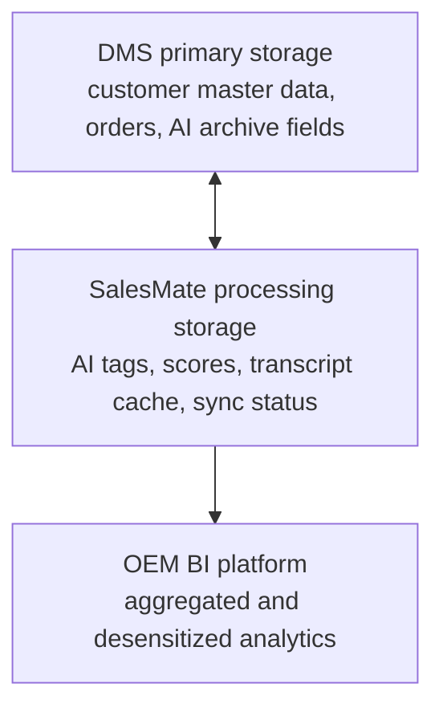

# Architecture Notes

## Design Principle

SalesMate AutoPilot is organized around a stable sales workflow, not a generic chat interface.

The demo flow is:

```text
Reception dialogue
  -> ASR transcription
  -> intent and signal extraction
  -> customer profile update
  -> recommendation and competitor support
  -> departure report generation
  -> DMS synchronization
  -> follow-up strategy
```

## ASR Boundary

The demo includes a mock ASR service:

```text
backend/src/asr/MockAsrService.js
```

Endpoint:

```text
POST /api/asr/transcribe
```

The frontend supports three ASR modes:

- `Mock`: stable scripted transcription.
- `Browser`: future Web Speech API or browser media capture.
- `Backend`: future streaming ASR service.

The important contract is that ASR returns text, speaker, confidence, and cursor/event metadata. The transcript is then sent into `/api/dialogue/ingest`, so the Agent system does not depend on the ASR provider.

## LLM / Workflow Adapter Boundary

The demo supports an optional local LLM enhancement layer:

```text
backend/src/llm/LlmService.js
backend/src/llm/OllamaClient.js
```

Default mode:

```text
LLM_PROVIDER=fallback
```

Optional local mode:

```text
LLM_PROVIDER=ollama
OLLAMA_BASE_URL=http://localhost:11434
OLLAMA_MODEL=qwen2.5:7b
```

The orchestration does not depend on a model being available. If Ollama is unavailable or returns invalid output, `LlmService` returns a deterministic rule-based fallback. Dify can later be integrated behind the same adapter boundary as a workflow provider.

## Agent Orchestration

`SalesOrchestrator` owns session state and calls each agent in order:

1. `ListenerAgent`
2. `ProfileAgent`
3. `RecommendationAgent`
4. `FollowupAgent`
5. `ArchiveCoordinator`

This keeps the demo understandable and makes each agent easy to replace later.

The orchestrator now exposes a visible coordination model:

```text
Agent Registry
  -> Execution Plan
  -> Shared Session Memory
  -> Run Log
```

Endpoint:

```text
POST /api/agents/coordination
```

Shared memory keys:

```text
dialogue
profile
recommendation
followup
archive
```

This makes the multi-agent coordination explicit in both the backend implementation and the frontend demo.

## Why Mock Data

The current version uses mock knowledge data for stability during a short competition build. This avoids depending on real ASR, DMS, or LLM services while still exposing the system boundaries.

Mock data includes:

- customer profile
- dialogue script
- vehicle recommendation data
- competitor comparison cards
- policy and finance boosters
- ontology keyword mapping

## DMS Adapter Boundary

The DMS layer lives under:

```text
backend/src/integrations/dms/
```

`MockDmsAdapter` can later be replaced by:

- REST API adapter
- SOAP adapter
- direct database adapter
- message queue adapter

The frontend should not know which DMS implementation is being used.

## Customer Archive Storage

The customer archive follows a three-layer storage design.



The current demo uses `ProcessingStore` as a lightweight file-backed simulation of the future SQLite processing layer.

```text
backend/runtime/processing-store.json
```

This keeps the demo dependency-light while still proving local persistence, sync status, and retry semantics.

Local records do not store raw customer phone numbers or authoritative customer identity data. They store:

- `customerRef`
- intent tags
- preference tags
- objection tags
- competitor list
- purchase probability
- transcript-derived processing text
- ontology cache
- card rescue events
- sales action logs
- DMS sync status

## Offline Sync Semantics

Archive records move through:

```text
PENDING -> SYNCED -> FAILED
```

Supported endpoints:

```text
GET  /api/storage/pending
POST /api/dms/retry-pending
```

In the demo, `retry-pending` can retry records for sessions that are still active in memory. In a production SQLite implementation, the orchestrator would reload pending sessions from local persistent tables.

Fields written back to DMS include:

- `ai_summary`
- `intent_tags`
- `objection_tags`
- `competitor_list`
- `purchase_probability`
- `next_followup_time`
- `followup_script_draft`
- `report_pdf_url`
